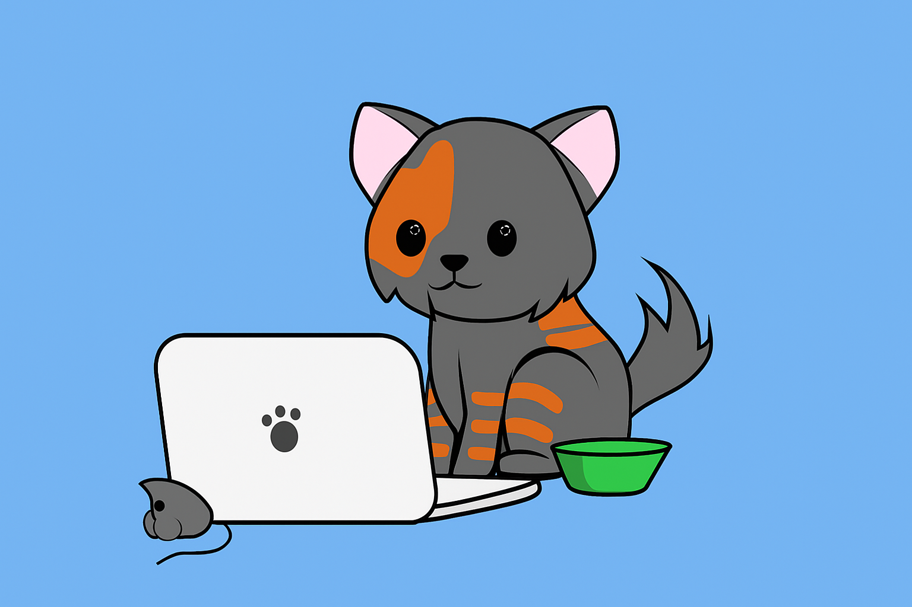

<h1 align="center">Hello There, This is Amio Rashid 🧑‍💻 </h1>
<h3 align="center"> Computer Science Undergrad | ML Enthusiast | AI Enthusiast </h3>

  

  

---
### 👩‍💻 About Me

- 🎓 Currently pursuing a Bachelor of Science (BSc) in Computer Science & Engineering at the University of Dhaka.
- 💬 Ask me about **C, C++, Java**
- 📫 Reach me at **amio-2021311235@cs.du.ac.bd**
- 📄 Know about my experience:  More actions

- ⚽ Football Lover & Hala Madrid 
- 🎬 Cinephile

## 🚀 Skills & Technologies

### 🌐 Web Development

  
  
  

### 🖥️ Programming Languages

  
  
  

### 🗄️ Databases

  
  
  

### 🐧 Operating Systems

- **Linux**
- **macOS**
- **Windows**

---

## 📊 GitHub Stats  

  
  
  

---

## 🚀 Contribution Graph:

  

---

## 📫 Connect with me:

  

  

